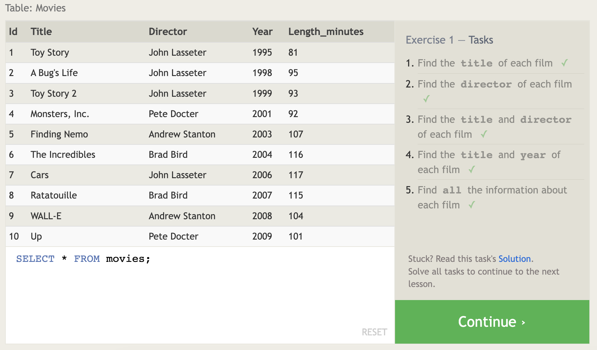
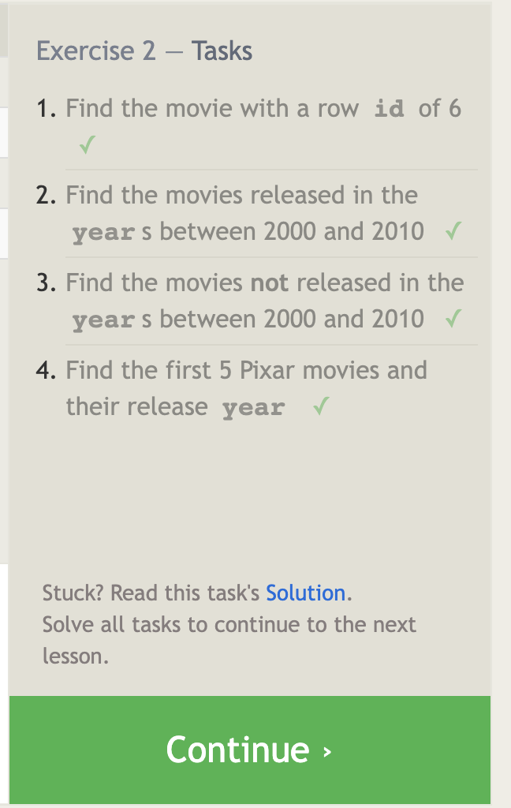

# 401 Prep: Introduction to SQL

Source: [SQL Bolt Tutorials](https://sqlbolt.com/)
**Lessons 1 through 6 - SQL Queries**
**Lessons 13 through 18 - Database Management**

------------------------------------

## When you are finished with all of the lessons, create a new entry in your reading notes repository summarizing your understanding of relational databases and SQL. Include all of your screen shots in this page.

**Summary of relational databases and SQL**

- Structured Query Language (SQL) allows both technical and non-technical users to query, manipulate, and transform data from a relational database while providing safe and scalable storage for millions of websites and mobile applications.

- Relational databases represent collections of related (two-dimensional) tables, each similary to an Excel spreadsheet and with a fixed number of named columns (table attributes/properties) and rows of data.

- SQL allows users to answer specific questions about a dataset.

----------------------------

## Scereenshots

